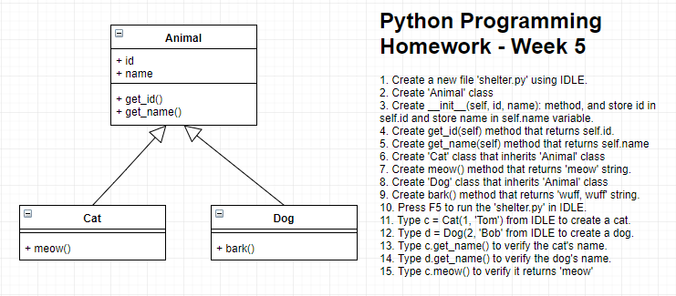

* [Presentation for Week 5](https://docs.google.com/presentation/d/1FUcFb78FCY9WI3JxZdZJAR-JmhqIJ4gZu3GnRlptivg/edit?usp=sharing)

* * *

### Let's Practice Typing
- Go to [Nitro Type](https://www.nitrotype.com)
- Practice typing for 5 minutes
- Let's measure your typing speed

* * *

### Object Oriented Programming (OOP)

- Please refer to the presentation
- [Source code for Crazy Giraffe](./crazygiraffe.py)

* * *

### Homework for this week

